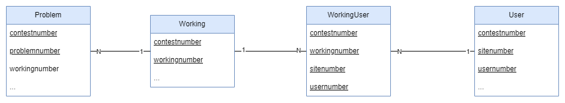
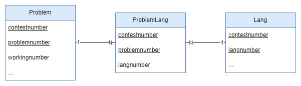

# boca-api

## Introdução

Esta API foi feita com o objetivo de propor uma interface de comunicação com o banco de dados do sistema de correção automático BOCA. O trabalho foi proposto pelo professor [Rodrigo Laiola](https://github.com/rlaiola) na disciplina de Banco de Dados I do Curso Engenharia de Computação na UFES, e realizado pelos alunos [Henrique Faria Ribeiro](https://github.com/riquefr) e [Henrique Paulino Cruz](https://github.com/HenriqueCruz5341).

## Desenvolvimento

Como foi dito, o código foi desenvolvido pelos alunos Henrique Faria Ribeiro e Henrique Paulino Cruz. Para isso foi utilizado o Visual Studio Code com a extensão Live Share, que permite que dois desenvolvedores trabalhem em um mesmo código ao mesmo tempo.

## Tecnologias

- [Node.js](https://nodejs.org/en/)
- [Docker](https://www.docker.com/)
- [PostgreSQL](https://www.postgresql.org/)

## Bibliotecas

- [Express](https://expressjs.com/pt-br/): Framework para Node.js que facilita a criação de rotas e requisições HTTP.
- [pgpromise](https://www.npmjs.com/package/pg-promise): Biblioteca para Node.js que facilita a conexão com o banco de dados PostgreSQL.
- [axios](https://www.npmjs.com/package/axios): Biblioteca para Node.js que facilita a criação de requisições HTTP.
- [jest](https://jestjs.io/pt-BR/): Biblioteca para Node.js que facilita a criação de testes unitários.

## Decisões de projeto

### Arquitetura

A arquitetura do projeto foi feita utilizando o padrão [Hexagonal](https://engsoftmoderna.info/artigos/arquitetura-hexagonal.html), que se baseia na ideia de construir sistemas que favorecem reusabilidade de código, alta coesão, baixo acoplamento, independência de tecnologia e que são mais fáceis de serem testados. Para isso foi utilizado de inspiração o seguinte [projeto](https://github.com/rodrigobranas/hexagonal_architecture_integration_unit_tests) do [Rodrigo Branas](https://github.com/rodrigobranas) no GitHub.

### Modelagem do banco de dados

A modelagem do banco de dados foi inicialmente provida pelo professor, com um desafio de incluir a tabela de Working no sistema. Essa tabela teria um relacionamento NxN com a tabela de User e um relacionamento 1xN com a tabela de Problem. Para resolver esse problema, foi criada uma tabela de WorkingUser, que teria um relacionamento 1xN com a tabela de User e um relacionamento 1xN com a tabela de Workings, como pode ser visto no diagrama abaixo:

Outro desafio foi a inclusão de um relacionamento entre as tabelas de Problem e Lang, que foi resolvido criando uma tabela de ProblemLang, que teria um relacionamento 1xN com a tabela de Problem e um relacionamento 1xN com a tabela de Lang, como pode ser visto no diagrama abaixo:

### Roteamento

Para fazer o roteamento da API, foi seguido o padrão REST, com alguns exemplos dados pelo próprio professor. Partindo dessa base todas as outras rotas criadas foram feitas e podem ser vistas na seção de [Documentação](#Documentação). Uma observação que vale ser citada é que nos exemplos providos pelo professor foi passado a seguinte rota para operações na tabela de WorkingUser `api/contest/:id_c/user/:id_u/working`, mas como uma tupla da tabela User não é identificado apenas por um id, mas também por um identificador do site ao qual pertence, a rota foi alterada para `api/contest/:id_c/site/id_s/user/:id_u/working`.

### Colunas de preenchimento automático

Algumas colunas em certas tabelas no banco de dados são preenchidas automaticamente pelo sistema do BOCA, pelo menos é o que dá a entender ao ler o nome dessas colunas. Alguns exemplos são as colunas `contestlastmileanswer` e `contestlastmilescore`, com isso essas colunas não foram incluídas na requisição de criação de novos registros. Uma outra coluna que o próprio sistema calcula, mas dessa vez não é o do BOCA e sim o da API, são as colunas `updatetime`, ou seja, toda vez que um registro é criado e atualizado, a coluna `updatetime` é preenchida com a data e hora atual, sem a necessidade que esse valor seja passado pelo body da requisição.

Para obter mais detalhes do que deve ser passado no body de cada requisição, basta acessar a seção de [Documentação](#Documentação).

### Body e Response

Para ficar de acordo com o padrão adotado no JSON, que é o camel case, os body e response das requisições foram mapeados dessa forma, ou seja, apesar do banco de dados estar sem nenhum padrão, as requisições e respostas são em camel case.

### Variáveis de ambiente

No projeto existem algumas variáveis de ambiente que podem ser configuradas diretamente nos arquivos de `docker-compose-api-dev.yml` e `docker-compose-api-prod.yml`. Essas variáveis são:

- `PORT`: Porta que a API irá rodar.
- `DB_HOST`: Host do banco de dados.
- `DB_PORT`: Porta do banco de dados.
- `DB_USER`: Usuário do banco de dados.
- `DB_PASSWORD`: Senha do banco de dados.
- `DB_NAME`: Nome do banco de dados.
- `UP_DATABASE`: Aceita os valores de `true` ou `false`, se for `true` a API irá atualizar e criar novas tabelas no banco de dados assim que for iniciada, se for `false` a API não fará essa ação. É recomendável deixar essa opção como `true` apenas a primeira vez que a API for executada, depois deve ser mudada para `false`.

## Instalação

Para instalar o projeto, é necessário ter o Node.js e o Docker instalados. Após isso, basta clonar o repositório e executar o comando `npm install` para instalar as dependências do projeto.

### Dev

Para executar o projeto em produção, basta executar o comando `npm run docker:dev`. Isso irá subir o banco de dados, a API e o adminer em containers Docker.

### Produção

Para executar o projeto em produção, basta executar o comando `npm run docker:prod`. Isso irá subir o banco de dados e a API em containers Docker. Mas diferente do modo de desenvolvimento, o código da API não será atualizado automaticamente, sendo necessário parar e subir novamente o container, e será todo compilado para JavaScript, ao invés de rodar o código TypeScript, o que dá uma pequena melhora de performance.

### Testes

Os testes feitos na aplicação são os testes E2E (end to end), que testam a aplicação como um todo, desde a requisição HTTP até a resposta HTTP. Para executar os testes, basta executar o projeto com modo [Dev](#dev) e depois utilizar o comando `npm run test`.

Da forma que foi mostrado anteriormente todos os testes serão executados, mas é possível executar apenas um teste específico, utilizando um comando personalizado para cada componente testado:

- `npm run test:content`: Testa o componente de contents.
- `npm run test:problem`: Testa o componente de problemas.
- `npm run test:language`: Testa o componente de linguagens.
- `npm run test:site`: Testa o componentes de sites.
- `npm run test:user`: Testa o componentes de usuários.
- `npm run test:problemLanguage`: Testa o componente de problemas linguagens.
- `npm run test:working`: Testa o componente de listas de exercícios.
- `npm run test:workingUser`: Testa o componente de listas de exercícios usuários.

## Documentação

Toda a documentação da API pode ser encontrada [aqui](https://documenter.getpostman.com/view/19737871/2s8YzZPJsn). Ela foi feita utilizando o Postman, e contém todas as rotas da API, com exemplos de requisições e respostas.
